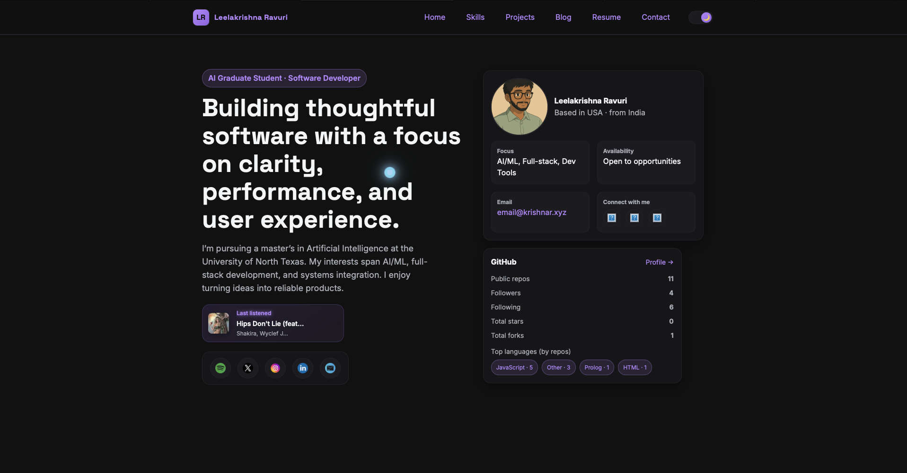
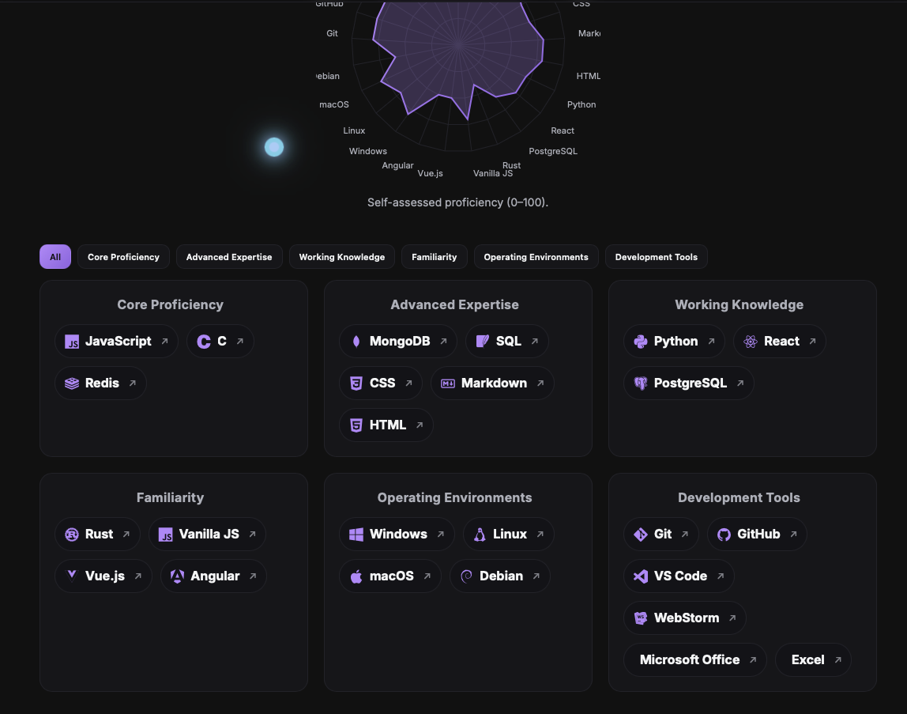

# 🌐 [Personal Portfolio](https://krishnar.xyz)

This is my personal portfolio website built with **Next.js 14**, **React**, and custom **Dracula-inspired theming**.  
It showcases my skills, projects, blog posts, and integrates with GitHub and Spotify APIs for dynamic content.

- 🚀 Deployed on [Vercel](https://vercel.com).
- 🌐 Need to see a demo? Click [here](https://krishnar.xyz).

---

## ✨ Features

- **Minimalist, responsive design**
  - Global navigation bar, smooth animations, system theme (dark/light).
  - Ghibli-style avatar branding.

- **Home**
  - Parallax hero section with socials and intro.
  - Floating social block (GitHub, LinkedIn, Twitter/X, Instagram, Email).
  - Clickable Github Tile, displaying your github info using [Github API](https://docs.github.com/en/rest?apiVersion=2022-11-28)

- **Skills**
  - Category filters + radar chart visualization.
  - Auto-rendered skill pills with icons and categories with their respective websites.

- **Projects**
  - Flip-card design with one card open at a time.
  - Detailed case study pages on flipping (can add more ..)

- **Blog**
  - MDX posts stored under `/app/blog/posts`.
  - You can write blogs or anything with a `.md` file to render it to into a file (cool stuff iykyk).

- **Resume**
  - Working on it, for now you can download it ..

- **Contact**
  - This actually works with [Resend API](https://resend.com/docs/dashboard/emails/introduction), you need to have a API key, get one from [here](https://resend.com/docs/dashboard/api-keys/introduction)

- **GitHub Integration**
  - Needs your own api key, get one from [here](https://github.com/settings/tokens)
  - API key is totally optional but recommended due to ratelimits
  - GitHub summary card on homepage (`GitHubCard.jsx`).
  - Expanded GitHub dashboard (`GithubExpanded.jsx`) with:
  - - Avatar, followers count, repos count, following count
    - Recent commits
    - Repository list
    - Language usage breakdown
    - Contribution calendar (same as github)
    

- **Spotify Integration**
  - Needs API key, find yours [here](https://developer.spotify.com/documentation/web-api)
  - Spotify card showing currently playing track with animated equalizer.
  - Fall back would be showing last completely played song.

---

## 🛠️ Tech Stack

- **Framework**: [Next.js 14](https://nextjs.org/) (App Router)
- **Language**: JavaScript (React 18)
- **Styling**: Custom CSS with theme variables
- **Animations**: [Framer Motion](https://www.framer.com/motion/)
- **Data Viz**: [Recharts](https://recharts.org/), Radar charts
- **3D/Visuals**: [Three.js](https://threejs.org/), [@react-three/fiber](https://github.com/pmndrs/react-three-fiber), [@react-three/drei](https://github.com/pmndrs/drei)
- **Blog Rendering**: [MDX](https://mdxjs.com/)
- **Deployment**: [Vercel](https://vercel.com)

---

## 📂 Project Structure

```
├── app/
│   ├── blog/           # MDX blog posts
│   ├── projects/       # Project case study pages
│   ├── skills/         # Skills page
│   └── layout.js       # Global layout & navigation
├── components/         # Reusable UI components
│   ├── GitHubCard.jsx
│   ├── GitHubExpanded.jsx
│   ├── SpotifyCard.jsx
│   ├── SkillsShowcase.jsx
│   └── ...
├── public/             # Static assets (avatar, icons, PDFs)
├── styles/
│   └── globals.css     # Global theme, variables, layout
├── package.json
└── README.md
```

---

## ⚙️ Setup & Development

1. **Clone the repo**
   ```bash
   git clone https://github.com/Leelakrishna-R/krishnar-portfolio.git
   cd krishnar-portfolio
   ```

2. **Install dependencies**
   ```bash
   npm install
   ```
   > ⚠️ If you hit peer dependency errors with `@react-three/drei`, use:
   > ```bash
   > npm install --legacy-peer-deps
   > ```

3. **Start the dev server**
   ```bash
   npm run dev
   ```

4. Open [http://localhost:3000](http://localhost:3000).

---

## 🔑 Environment Variables

Create a `.env.local` file at the root:

```env
spotifyClientID=KEY //get from https://developer.spotify.com/documentation/web-api
spotifyClientSecret=KEY //get from https://developer.spotify.com/documentation/web-api
spotifyRefreshToken=KEY //auto generates when you run /scripts/getSpotifyRefreshToken.js, paste it here
RESEND_API_KEY=KEY //get from https://resend.com/docs/dashboard/emails/introduction
CONTACT_TO_EMAIL=EMAIL //the inbox email where you want to receive
CONTACT_FROM_EMAIL=onboarding@resend.dev //should be this default but read docs
GITHUB_TOKEN=KEY // your github api key https://github.com/settings/tokens 
```
---

## 🖼️ Screenshots

### Home


### Skills


---

## 📦 Deployment

- Pushed to GitHub and deployed with **Vercel**.
- Configure environment variables in the Vercel dashboard.
- Automatic builds on push to `main`.

---

## 📄 License

This project is licensed under the MIT License.  
Feel free to fork and adapt it for your own portfolio!

---

## ‼️ Issues
- I do have some issues time to time which can be found [here](https://github.com/LeelaKrishna-R/mywebsite/issues)
-  if you have a solution to my issue, feel free to open a [PR](https://github.com/LeelaKrishna-R/mywebsite/pulls)

👨‍💻 Built with care by **Leelakrishna Ravuri**.
